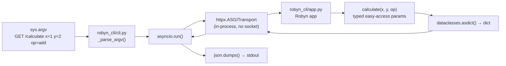

# Robyn Solution Implementation

## Files to create

### `robyn/pyproject.toml`

```toml
[project]
name = "robyn"
version = "0.1.0"
requires-python = ">=3.12"
dependencies = ["robyn>=0.67.0", "httpx>=0.28.1"]
```

`httpx` is needed for `ASGITransport`. Run `uv sync` inside `robyn/` to produce `.venv` and `uv.lock`.

### `robyn/robyn_cli/__init__.py`

Empty (marks the package).

### `robyn/robyn_cli/app.py`

Response shapes are captured as stdlib `dataclass` models inline in this file — no Pydantic, no extra import cost. Pydantic is ruled out because `pydantic-core` (a Rust `.so`) would compound the cold-start penalty on top of Robyn's own extension.

Robyn supports typed easy-access params in handler signatures (auto-coerced, 400 on bad input), so no manual `request.query_params` parsing is needed.

```python
from __future__ import annotations
import dataclasses, json
from robyn import Robyn, Response

app = Robyn(__file__)

# --- response models (stdlib dataclass, zero extra deps) ---

@dataclasses.dataclass
class PingResponse:
    status: str = "ok"

@dataclasses.dataclass
class CalculateResponse:
    op: str
    x: float
    y: float
    result: float

@dataclasses.dataclass
class ErrorResponse:
    detail: str
    def to_json(self) -> str:
        return json.dumps(dataclasses.asdict(self))

# --- routes ---

@app.get("/ping")
def ping():
    return dataclasses.asdict(PingResponse())

@app.get("/calculate")
def calculate(x: float, y: float, op: str = "add"):
    ops = {"add": x + y, "sub": x - y, "mul": x * y, "div": None}
    if op not in ops:
        return Response(400, {}, ErrorResponse(f"Unknown op '{op}'").to_json())
    if op == "div" and y == 0:
        return Response(422, {}, ErrorResponse("Division by zero").to_json())
    result = x / y if op == "div" else ops[op]
    return dataclasses.asdict(CalculateResponse(op=op, x=x, y=y, result=result))
```

### `robyn/robyn_cli/cli.py`

Uses `httpx.AsyncClient` with `ASGITransport` for in-process dispatch — no real socket opened. The client is created fresh per CLI invocation (acceptable for the cold-start use case).

Argv contract mirrors the Falcon plan for consistency:

```text
[METHOD] <path> [key=value ...]
```

- `METHOD` is optional and defaults to `GET` (when omitted, first positional token is treated as `<path>`)
- `GET` / `DELETE` / `HEAD`: `key=value` tokens are sent as query params
- `POST` / `PUT` / `PATCH`: `key=value` tokens are sent as JSON body fields

> **Implementation-time note**: `ASGITransport` requires Robyn to expose a standard ASGI callable (`async (scope, receive, send) → None`). Robyn runs on a Rust/actix-web backend and may not implement this protocol. If `ASGITransport(app=app)` raises at construction time, record the finding — this is part of the experiment.

```python
import asyncio, json, sys
import httpx
from robyn_cli.app import app

_METHODS = {"GET", "POST", "PUT", "PATCH", "DELETE", "HEAD", "OPTIONS"}

def _parse_argv(argv: list[str]) -> tuple[str, str, dict[str, str]]:
    method = "GET"
    if argv and argv[0].upper() in _METHODS:
        method, argv = argv[0].upper(), argv[1:]
    # path + key=value parsing (same token split behavior as other solutions)
    ...
    return method, path, params

async def _request(method: str, path: str, params: dict[str, str]) -> httpx.Response:
    query = params if method in ("GET", "DELETE", "HEAD") else None
    body  = params if method not in ("GET", "DELETE", "HEAD") else None
    async with httpx.AsyncClient(
        transport=httpx.ASGITransport(app=app),
        base_url="http://test",
    ) as client:
        return await client.request(method, path, params=query, json=body)

def main(argv: list[str] | None = None) -> None:
    method, path, params = _parse_argv(argv if argv is not None else sys.argv[1:])
    response = asyncio.run(_request(method, path, params))
    try:
        print(json.dumps(response.json(), indent=2))
    except Exception:
        print(response.text)
    sys.exit(0 if response.is_success else 1)

if __name__ == "__main__":
    main()
```

## Data flow




## Key unknowns to measure / verify

- `**.so` load time**: Robyn loads a compiled Rust extension on first `import robyn`. Expect this to dominate cold-start; measure via subprocess `python -c "import robyn"`.
- **ASGI interface**: Does `Robyn.__call__(scope, receive, send)` exist? `httpx.ASGITransport` needs this. Verify at implementation time; if Robyn doesn't expose it, record that as a finding.
- `**asyncio.run()` overhead**: Each CLI invocation creates a new event loop. This is the correct model for a subprocess CLI but adds a small fixed cost. Measure in-process to quantify.
- **Dict returns**: Robyn auto-serialises returned dicts to JSON, matching the contract.

